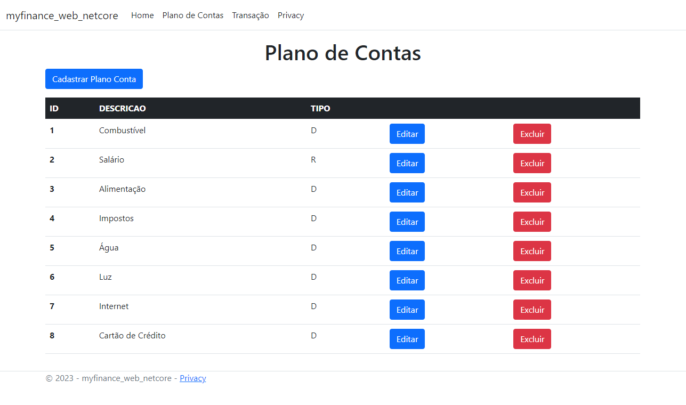
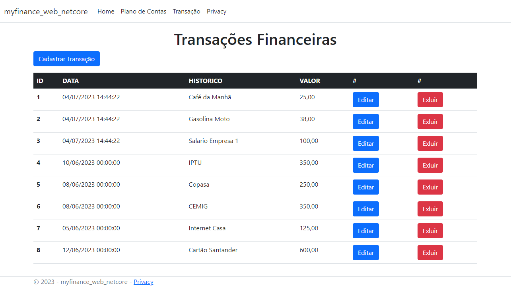

## Autores

- [@julianopucmg](https://github.com/julianopucmg)
- [@Silva01](https://github.com/Silva01)


# MyFinance Web

Projeto desenvolvido para a disciplina de Práticas de Implementação e Evolução de Software da PUC-Minas. O MyFinance Web é um sistema para controlas as finanças pessoais.

## Descrição
O MyFinance Web é uma aplicação web que permite aos usuários gerenciar suas finanças pessoais de forma eficiente. A aplicação oferece recursos para controlar despesas e receitas, no seu plano de contas, assim como as transações financeiras, visualizar relatórios e gráficos.





## Funcionalidades Principais
    1. Plano de Contas
        ◦ CRUD de Plano de Contas
        ◦ Atributos: Descrição e Tipo (receita ou despesa)

    2. Transações Financeiras
        ◦ Registrar as transações financeiras do dia
        ◦ Atributos: Data da Transação, Valor, Plano de Conta e Histórico

## Tecnologias Utilizadas
    1. Frontend: HTML
    2. Backend: ASP.NET CORE MVC na versão .NET 6.0
    3. Banco de Dados: SQL-Server


## Clone o repositório
git clone https://github.com/seu-usuario/myfinance-web-dotnet

## Instalação

Necessário Instalar EntityFrameworkCore e EntityFrameworkCore.SqlServer

```
...cd myfinance-web-dotnet
```

```
dotnet add package Microsoft.EntityFrameworkCore --version 8.0.0-preview.5.23280.1
```
```
dotnet add package Microsoft.EntityFrameworkCore.SqlServer --version 8.0.0-preview.5.23280.1
```


## Execute a aplicação
```
dotnet build
```
```
dotnet run
```


